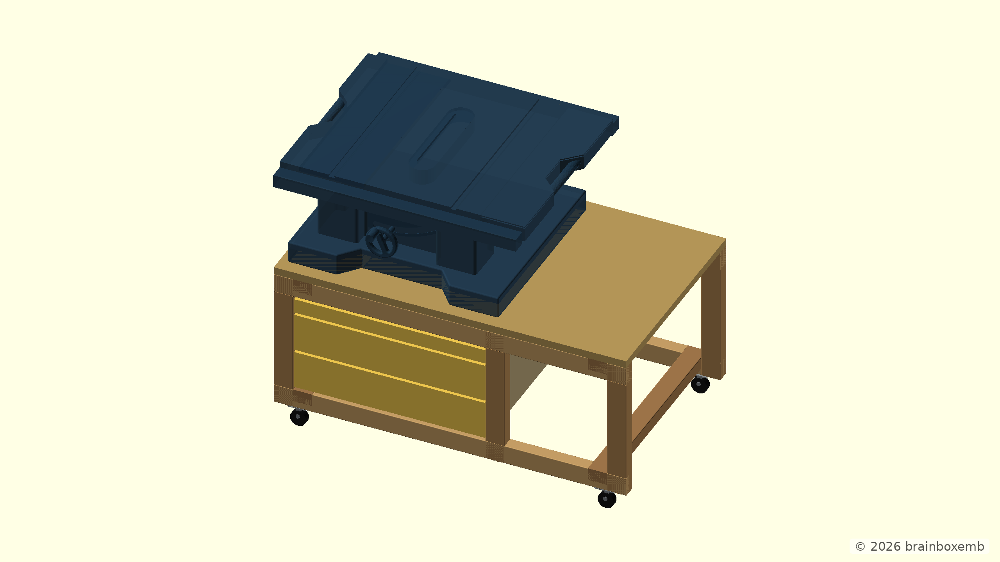
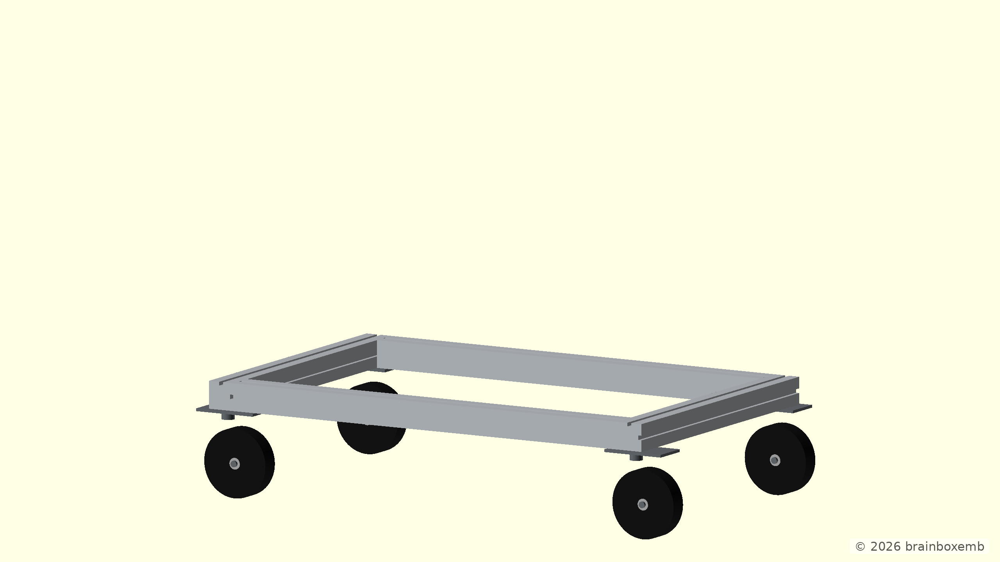

# Bosch GTS 10 XC table stand

The model and documentation were developed with the assistance of ChatGPT.

This project explores a mobile workshop table for the Bosch GTS 10 XC table saw.

## Versions

### v1.0 — reference design

Version 1.0 models the existing solution published by Pragmatic Workshop. It is
kept as a reference baseline for the timber construction, storage arrangement
and half-lap joints.

**Reference:**  
[My Bosch GTS 10 XC Stand – Pragmatic Workshop](https://pragmatic-workshop.amon.de/blog/my-bosch-gts-10-xc-stand/)

The representative v1.0 render is generated from
`v1.0/cad/renders/assembly.scad`.



### v1.1 — aluminium mobile base

Version 1.1 starts the custom design.

Instead of beginning with the timber cabinet, the design starts from a
**1060 × 670 mm mobile aluminium base frame** made from assumed **60 × 60 mm
60-series extrusion**.

The two transverse profiles span the full 670 mm width. The longitudinal
profiles are enclosed between them and are therefore 940 mm long.

This aluminium frame becomes the foundation for the future 60 × 40 mm timber
upper structure and the Bosch GTS 10 XC installation.

v1.1 follows the same coordinate convention as v1.0: `[0,0,0]` is the front-left floor point rather than the centre of the model.



The representative assembly renders use a flatter three-quarter view so the frame proportions and front construction remain easy to read.

More detail is documented in [`v1.1/doc/design.md`](v1.1/doc/design.md).


### CAD folder convention

- `components/` contains reusable, standalone OpenSCAD components.
- `project-components/` contains geometry that only has meaning as part of this table project.
- `external/` contains externally supplied reference geometry.

## Repository layout

```text
v1.0/
├── cad/
│   ├── components/
│   │   ├── bosch-gts10xc-reference.scad
│   │   ├── casters.scad
│   │   └── geometry-helpers.scad
│   ├── project-components/
│   │   ├── cabinet.scad
│   │   └── timber-frame.scad
│   ├── external/
│   ├── renders/
│   └── exports/
│       └── assembly.scad
├── doc/
└── out/

v1.1/
├── cad/
│   ├── components/
│   │   └── bosch-gts10xc-reference.scad
│   ├── project-components/
│   │   └── aluminium-base-frame.scad
│   ├── external/
│   │   └── bosch-gts10xc/
│   │       └── Bosch_GTS_10_XC.stl
│   ├── renders/
│   │   ├── assembly.scad
│   │   ├── base-with-wheels.scad
│   │   └── frame.scad
│   ├── exports/
│   ├── assemblies/
│   │   └── table.scad
│   ├── config.scad
│   └── main.scad
├── doc/
│   └── design.md
└── out/
    ├── png/
    └── stl/
```

`main.scad` is the central OpenSCAD entrypoint for each version. The complete table assembly lives in `assemblies/table.scad`.

Render files include `../assemblies/table.scad` directly.

## GitHub render configuration

The render prefix is **`table`** for both versions:

```text
v1.0/cad|v1.0/out/png|table
v1.1/cad|v1.1/out/png|table
```

For example, `v1.1/cad/renders/assembly.scad` becomes:

`v1.1/out/png/table-assembly.png`

## STL exports

Both versions contain a complete-assembly STL export entrypoint:

```text
v1.0/cad/exports/assembly.scad
v1.1/cad/exports/assembly.scad
```

With the project prefix **`table`**, the expected GitHub-generated STL files are:

```text
v1.0/out/stl/table-assembly.stl
v1.1/out/stl/table-assembly.stl
```

The export represents the complete assembly as it exists in that version. More
individual exports should only be added when they are actually useful.
